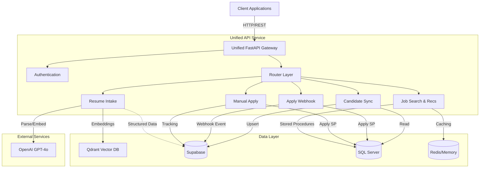
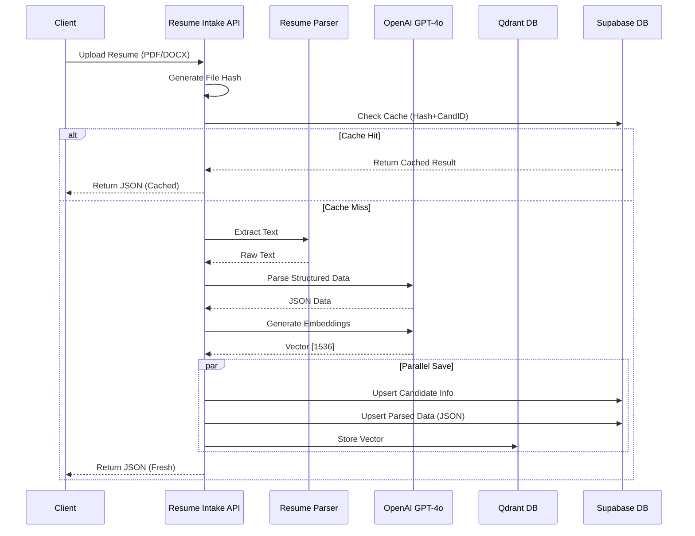
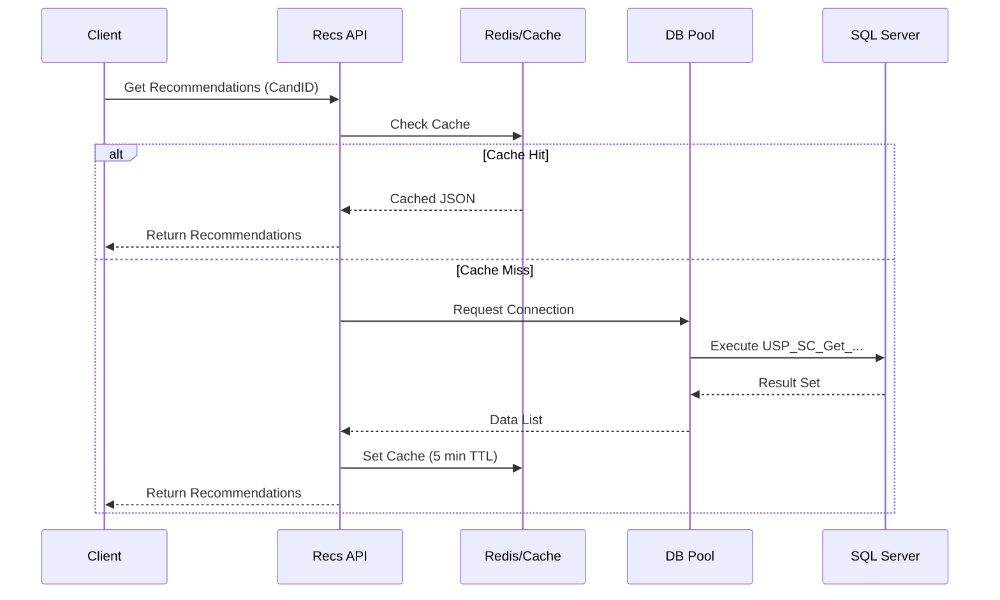

# AutoApply Candidate Sync API

Unified FastAPI monorepo combining candidate synchronization, job application webhook processing, and resume intake.

## Overview

This project merges seven FastAPI services into a single unified application:

1. **Apply Webhook API** - Listens to Supabase webhooks for job-candidate matches and automatically applies candidates to jobs
2. **Candidate Sync API** - Synchronizes candidate data from SQL Server to Supabase
3. **Resume Intake API** - Processes resume files (PDF/DOCX/TXT), extracts structured data using GPT-4o, and stores embeddings in Qdrant
4. **Get Recommendations API** - Retrieves job recommendations for candidates using SQL Server stored procedures with caching and rate limiting
5. **Get Requirement Details API** - Fetches requirement/job details by ID from SQL Server with caching and rate limiting
6. **Manual Apply API** - Manually applies a candidate to a job requirement by accepting candidate_id and requirement_id directly


## 🏗️ Architecture



---

## 📁 Project Structure

```
.
├── app/
│   ├── __init__.py
│   ├── main.py                 # Unified FastAPI application entry point
│   ├── api/
│   │   ├── __init__.py
│   │   ├── apply_webhook/      # Apply Webhook API module
│   │   │   ├── router.py       # FastAPI routes
│   │   │   ├── logic.py        # Business logic
│   │   │   └── models.py       # Pydantic models
│   │   └── candidate_sync/     # Candidate Sync API module
│   │       ├── router.py       # FastAPI routes
│   │       ├── logic.py        # Business logic
│   │       └── schemas.py      # Pydantic schemas
│   │   ├── resume_intake/      # Resume Intake API module
│   │   │   ├── router.py       # FastAPI routes
│   │   │   └── logic.py        # Processing pipeline
│   │   ├── recommendations/    # Get Recommendations API module
│   │   │   └── router.py       # FastAPI routes for job recommendations
│   │   └── requirement_details/ # Get Requirement Details API module
│   │       ├── router.py       # FastAPI routes for requirement details
│   │       └── schemas.py      # Pydantic models

│   │   └── manual_apply/      # Manual Apply API module
│   │       ├── router.py       # FastAPI routes for manual job applications
│   │       ├── logic.py        # Business logic
│   │       └── schemas.py      # Pydantic models
│   ├── db/
│   │   ├── __init__.py
│   │   └── sql_server.py       # SQL Server connections and repositories
│   ├── supabase/
│   │   ├── __init__.py
│   │   └── client.py           # Supabase clients and repositories
│   ├── services/
│   │   ├── __init__.py
│   │   ├── resume_intake/      # Resume Intake services
│   │   │   ├── resume_parser.py    # PDF/DOCX/TXT parsing
│   │   │   ├── database.py         # Supabase operations
│   │   │   ├── embeddings.py       # OpenAI embeddings
│   │   │   └── vector_store.py     # Qdrant operations
│   │   ├── recommendations/    # Get Recommendations services
│   │   │   ├── db_pool.py          # Database connection pool
│   │   │   ├── cache_manager.py    # Caching (memory/Redis)
│   │   │   └── database_service.py # Stored procedure execution
│   │   └── requirement_details/ # Get Requirement Details services
│   │       ├── db_pool.py          # Database connection pool
│   │       └── cache.py            # Caching with aiocache

│   └── utils/
│       ├── __init__.py
│       ├── retry_utils.py       # Retry logic with exponential backoff
│       └── logger.py           # Logging configuration
├── config.py                    # Unified configuration
├── requirements.txt             # Merged Python dependencies
├── .env.example                 # Environment variables template
├── .gitignore                   # Git ignore rules
├── Dockerfile                   # Docker configuration
└── README.md                    # This file

## 🔒 Security & Observability

### 1. Environment Encryption
Sensitive credentials in `.env` are encrypted at rest using **Fernet (symmetric encryption)**.

- **Tool**: `scripts/manage_secrets.py`
- **Key**: `master.key` (Added to `.gitignore`)
- **Runtime**: `config.py` transparently decrypts values starting with `gAAAA...`.

**Usage:**
```bash
# 1. Generate Key
python scripts/manage_secrets.py generate

# 2. Encrypt .env
python scripts/manage_secrets.py encrypt

# 3. Decrypt .env (for editing)
python scripts/manage_secrets.py decrypt
```

### 2. Centralized Logging (Supabase)
All logs are asynchronously shipped to the `auto_apply_apis_logs` table in Supabase without blocking the main thread.

- **Handler**: `SafeSupabaseHandler` (uses background worker thread)
- **Levels**:
    - `ERROR/CRITICAL`: Automatically logged.
    - `INFO/WARNING`: Logged ONLY if `extra={'log_to_db': True}` is passed.

**Log Schema:**
| Column | Description |
|--------|-------------|
| `service_name` | Name of the service (e.g., `resume_intake`) |
| `level` | Log level (INFO, ERROR) |
| `message` | Human-readable message |
| `metadata` | JSONB column for extra context (cand_id, stack_trace, etc.) |

---

## 🚀 Quick Start

### 1. Prerequisites

- Python 3.11+
- ODBC Driver 18 for SQL Server
- Supabase account with service role key
- SQL Server access

### 2. Install Dependencies

```bash
# Create virtual environment
python -m venv .venv

# Activate virtual environment
# Windows PowerShell:
.venv\Scripts\Activate.ps1
# Windows CMD:
.venv\Scripts\activate.bat
# Linux/Mac:
source .venv/bin/activate

# Install packages
pip install -r requirements.txt
```

### 3. Configure Environment Variables

Copy `.env.example` to `.env` and fill in your credentials:

```bash
cp .env.example .env
```

Edit `.env` with your actual values. **Required variables:**
- `SUPABASE_URL` - Your Supabase project URL
- `SUPABASE_SERVICE_KEY` - Your Supabase service role key
- `SQLSERVER_CONNECTION_STRING` - SQL Server connection string (or individual SQL_SERVER_* parameters)

### 4. Run the Application

**Development mode:**
```bash
python -m app.main
```

**Using uvicorn directly:**
```bash
uvicorn app.main:app --reload --host 0.0.0.0 --port 8000
```

**Production mode:**
```bash
uvicorn app.main:app --host 0.0.0.0 --port 8000 --workers 4
```

The API will be available at: `http://localhost:8000`

---

## 📡 API Endpoints

### Health Checks

- `GET /` - Basic health check
- `GET /health` - Detailed health check with version info

### Apply Webhook API

- `POST /webhook/cand-job-matching` - Receives Supabase webhook events

**Description:**
This endpoint processes webhook events from Supabase when a new job-candidate match is created. It performs the following checks before applying:

1. Validates webhook event (must be INSERT on `cand_job_matching` table)
2. Checks if `similarity_score >= 0.7` (threshold check)
3. Fetches candidate data from `auto_apply_cand` table
4. **Remote Preference Filter:** 
   - If candidate has `is_remote_preferred = true`:
     - Checks if job has `is_remote_location = true` in `parsed_requirements` table
     - If job is explicitly non-remote (`is_remote_location = false`), skips application
     - If job is remote or flag is NULL/missing, proceeds with application
   - If candidate has `is_remote_preferred = false` or missing, proceeds directly (no remote check)
5. Executes `Usp_SC_JobSeeker_IU_ApplyJob` stored procedure
6. Creates tracking record in `job_application_tracking` table

**Request Body:**
```json
{
  "type": "INSERT",
  "table": "cand_job_matching",
  "record": {
    "matching_id": 1,
    "cand_id": 2928,
    "requirement_id": "1001",
    "similarity_score": 0.85,
    "match_reason": "High skill match",
    "matched_skills": ["Python", "FastAPI", "SQL"],
    "matched_at": "2025-01-20T10:00:00Z",
    "is_active": true
  }
}
```

**Response (Success):**
```json
{
  "success": true,
  "message": "Stored procedure executed successfully",
  "matching_id": 1,
  "cand_id": 2928,
  "requirement_id": "1001",
  "similarity_score": 0.85,
  "selection_id": null,
  "application_id": 14
}
```

**Response (Skipped - Remote Preference Mismatch):**
```json
{
  "success": false,
  "message": "Candidate prefers remote but job is not remote. Skipping application.",
  "cand_id": 2928,
  "requirement_id": "1001",
  "similarity_score": 0.85
}
```

**Response (Skipped - Low Similarity Score):**
```json
{
  "success": false,
  "message": "Similarity score 0.65 is below threshold 0.7. Skipping stored procedure execution.",
  "similarity_score": 0.65
}
```

**Note:**
- Similarity score threshold: `>= 0.7` required to proceed
- Remote preference filtering: Only applies when candidate explicitly prefers remote (`is_remote_preferred = true`)
- Missing flags: If `is_remote_preferred` is missing/NULL, treated as `false` (no preference)
- Job remote flag: If `is_remote_location` is NULL/missing, application proceeds (no restriction)
- All skipped events return HTTP 200 to acknowledge webhook receipt

### Candidate Sync API

- `POST /candidate-sync` - Synchronizes a candidate from SQL Server to Supabase

**Description:**
This endpoint synchronizes candidate data from SQL Server to Supabase. It performs the following steps:

1. Receives candidate email in request body
2. Queries SQL Server `CandidateMaster` table to find candidate by email
3. Validates results:
   - If no candidate found → returns 404
   - If multiple candidates found → returns 409 (conflict)
   - If exactly one candidate found → proceeds
4. Serializes candidate data (ID, name, email, phone, address, etc.)
5. Upserts candidate into Supabase `auto_apply_cand` table (upsert based on email unique constraint)
6. Returns synchronized candidate data

**Request Body:**
```json
{
  "email": "candidate@example.com"
}
```

**Response (Success - 200):**
```json
{
  "success": true,
  "message": "Candidate synchronized successfully.",
  "data": {
    "candidate_id": 123,
    "first_name": "John",
    "last_name": "Doe",
    "email": "candidate@example.com",
    "mobile": "+1234567890",
    "home": "+1234567891",
    "work": "+1234567892",
    "relocation": false,
    "over_18_age": true,
    ...
  }
}
```

**Response (Not Found - 404):**
```json
{
  "detail": "We could not find an account with that email."
}
```

**Response (Multiple Accounts - 409):**
```json
{
  "detail": "Found multiple accounts with your email please contact the support team."
}
```

**Note:**
- Uses SQL Server connection pool for efficient database access
- Upsert operation ensures idempotency (can be called multiple times safely)
- Candidate ID from SQL Server is preserved in Supabase (`cand_id` field)
- All phone numbers, addresses, and personal information are synchronized

### Resume Intake API

- `POST /resume-intake/process-resume` - Process a resume file and extract structured data

**Query Parameters:**
- `candidate_id` (required, int): Candidate ID from logged-in user

**Request:**
```bash
curl -X POST "http://localhost:8000/resume-intake/process-resume?candidate_id=123" \
  -F "file=@resume.pdf"
```

- Plain Text (`.txt`)

**Process Flow:**


**Supported File Types:**
- PDF (`.pdf`)
- Microsoft Word (`.docx`, `.doc`)
- Plain Text (`.txt`)

**Response (Success - 200):**
```json
{
  "success": true,
  "candidate_id": 123,
  "message": "Resume processed successfully. Candidate ID: 123",
  "cached": false
}
```

**Response (Cached - 200):**
```json
{
  "success": true,
  "candidate_id": 123,
  "message": "Resume processed successfully. Candidate ID: 123",
  "cached": true
}
```

**Processing Pipeline:**
1. **File Upload & Validation:**
   - Receives resume file (PDF/DOCX/TXT)
   - Validates file type and size
   - Generates file hash for cache key
   - Checks cache using `(file_hash, candidate_id)` key

2. **Text Extraction:**
   - If cache miss, extracts text from resume file:
     - PDF: Uses PyPDF2 or pdfplumber
     - DOCX: Uses python-docx
     - TXT: Reads directly

3. **Data Structuring (GPT-4o):**
   - Sends extracted text to GPT-4o with structured prompt
   - Extracts: personal info, professional experience, education, skills, certifications, projects
   - Returns structured JSON with snake_case keys

4. **Database Updates (Supabase):**
   - Updates `auto_apply_cand` table:
     - Personal information (name, email, phone, location)
     - Resume metadata (file name, size, type, upload date)
     - Experience years calculated from employment dates
   - Upserts `parsed_cand_resume` table:
     - Full structured JSON data
     - Resume text content
     - Skills arrays (technical, soft, languages)
     - Education, certifications, projects as JSONB

5. **Vector Embeddings:**
   - Generates embeddings using OpenAI `text-embedding-3-large` model
   - Creates embedding vector (1536 dimensions)

6. **Vector Storage (Qdrant):**
   - Stores embedding in Qdrant vector database
   - Associates with candidate_id for semantic search
   - Enables similarity-based job matching

7. **Cache Result:**
   - Caches processed result for 1 hour
   - Prevents reprocessing same file for same candidate

**Additional Endpoints:**
- `GET /resume-intake/cache/stats` - Get cache statistics

**Note:** 
- Rate limited to 10 requests per minute per IP address
- Results are cached for 1 hour based on file hash and candidate_id
- The candidate must already exist in the `auto_apply_cand` table

### Get Recommendations API

- `GET /api/recommendations?candidate_id={id}&use_cache={true|false}` - Get job recommendations for a candidate

**Description:**
This endpoint retrieves job recommendations for a candidate using SQL Server stored procedures. It performs the following steps:

1. Validates `candidate_id` parameter (must be > 0)
2. Checks cache using `candidate_id` as key (if `use_cache=true`)
3. If cache hit, returns cached recommendations immediately
4. If cache miss:
   - Acquires database connection from pool
   - Executes stored procedure `USP_SC_Get_JobSeekerRecommenededJobList` with candidate_id
   - Processes results and formats response
   - Caches results with TTL (default: 5 minutes)
   - Returns recommendations
5. Applies rate limiting (default: 60 requests/minute per IP)

**Query Parameters:**
- `candidate_id` (required, int): The candidate ID to get recommendations for (must be > 0)
- `use_cache` (optional, bool): Whether to use cache for this request (default: true)

**Response (Success - 200):**
```json
{
  "candidate_id": 1236,
  "recommendations": [
    {
      "Jobtitle": "Software Developer",
      "JobDescription": "We are looking for an experienced software developer...",
      "Duration": "Permanent",
      "Category": "IT",
      "JobType": "Full-time",
      "Remote/On-site": "Hybrid",
      "Client": "Tech Corp",
      "Location": "New York, NY"
    }
  ],
  "total_count": 50,
  "page_no": 1,
  "page_size": 10
}
```

**Additional Endpoints:**
- `GET /api/recommendations/cache/stats` - Get cache statistics
- `DELETE /api/recommendations/cache/clear` - Clear all cached entries

**Process Flow:**


**Note:**
- Executes stored procedure `USP_SC_Get_JobSeekerRecommenededJobList`
- Rate limited (configurable, default: 60 requests per minute per IP)
- Results are cached with TTL (default: 5 minutes)
- Supports both in-memory and Redis caching
- Includes retry logic with exponential backoff for database operations
- Uses connection pooling for efficient database access

### Get Requirement Details API

- `GET /api/requirement/{requirement_id}?company_id=1` - Get requirement details by ID

**Description:**
This endpoint fetches detailed information about a job requirement by ID. It performs the following steps:

1. Validates `requirement_id` path parameter (must be > 0)
2. Validates `company_id` query parameter (default: 1, must be > 0)
3. Generates cache key from `requirement_id` and `company_id`
4. Checks cache for existing result
5. If cache hit, returns cached requirement details immediately
6. If cache miss:
   - Acquires database connection from async pool
   - Executes stored procedure `Beta_usp_Get_Requirement_Details` with requirement_id and company_id
   - Maps database column names to API response keys
   - Caches result with TTL (default: 5 minutes = 300 seconds)
   - Returns requirement details
7. If requirement not found, returns 404
8. Applies rate limiting (default: 100 requests/minute per IP)

**Path Parameters:**
- `requirement_id` (required, int): The requirement ID to fetch (must be > 0)

**Query Parameters:**
- `company_id` (optional, int): Company ID (default: 1, must be > 0)

**Response (Success - 200):**
```json
{
  "JobTitle": "Software Engineer",
  "City": "New York",
  "ZIPCode": "10001",
  "Duration": "12 months",
  "ShiftTimingFrom": "09:00",
  "ShiftTimingTo": "18:00",
  "HoursPerWeek": 37.5,
  "MinPayRate": 50000.0,
  "MaxPayRate": 80000.0,
  "JobDescription": "Job description here..."
}
```

**Response (Not Found - 404):**
```json
{
  "detail": "Requirement with ID 123 not found"
}
```

**Process Flow:**
```
Request → Validate Parameters → Generate Cache Key → Check Cache → [If miss] Get DB Connection → Execute SP → Map Fields → Cache Result → Return
```

**Response Field Mapping:**

| Database Column | API Response Key |
|----------------|------------------|
| JobTitleText | JobTitle |
| CityName | City |
| ZIPCode | ZIPCode |
| RequirementDuration | Duration |
| RequirementShiftTimingFrom | ShiftTimingFrom |
| RequirementShiftTimingTo | ShiftTimingTo |
| RequirementHoursPerWeek | HoursPerWeek |
| MinPayRate | MinPayRate |
| MaxPayRate | MaxPayRate |
| RequirementJobDescription | JobDescription |

**Note:**
- Executes stored procedure `Beta_usp_Get_Requirement_Details`
- Rate limited (configurable, default: 100 requests per minute per IP)
- Results are cached with TTL (default: 5 minutes = 300 seconds)
- Uses async database connection pooling
- Cache key includes both requirement_id and company_id for proper isolation


### Manual Apply API

- `POST /apply-job` - Manually applies a candidate to a job requirement

**Description:**
This endpoint allows manual job applications without requiring a webhook event or similarity score. It performs the following steps:

1. Receives `cand_id` and `requirement_id` in request body
2. Fetches candidate data from Supabase `auto_apply_cand` table (with retry logic)
3. Validates candidate exists (returns 400 if not found)
4. Extracts candidate demographic data (disability_id, veteran_disclosure_id, ethnicity_id, race_id, gender_id)
5. Prepares stored procedure parameters for `Usp_SC_JobSeeker_IU_ApplyJob`
6. Executes stored procedure in SQL Server (with retry logic and exponential backoff)
7. Creates tracking record in Supabase `job_application_tracking` table:
   - Sets `matching_id = NULL` (no matching record)
   - Sets `similarity_score = NULL` (no similarity calculation)
   - Sets `application_status = "MATCHED"`
   - Records `applied_at` timestamp
8. Returns success response with `selection_id` and `application_id`

**Request Body:**
```json
{
  "cand_id": 2928,
  "requirement_id": 130174
}
```

**Response (Success - 200):**
```json
{
  "success": true,
  "message": "Job application submitted successfully",
  "cand_id": 2928,
  "requirement_id": 130174,
  "selection_id": 12345,
  "application_id": 789
}
```

**Response (Error - 400):**
```json
{
  "detail": "Candidate with cand_id 2928 not found in auto_apply_cand table"
}
```

**Response (Error - 500):**
```json
{
  "detail": "Internal server error: [error message]"
}
```

**Process Flow:**
```
Request → Validate Input → Fetch Candidate Data → Prepare SP Params → Execute SP → Create Tracking Record → Return Success
```

**Features:**
- ✅ Direct application without webhook or similarity score requirement
- ✅ Fetches candidate data from Supabase `auto_apply_cand` table
- ✅ Executes `Usp_SC_JobSeeker_IU_ApplyJob` stored procedure in SQL Server
- ✅ Creates tracking record in `job_application_tracking` table
- ✅ Tracking record has NULL `matching_id` and `similarity_score` (manual application)
- ✅ Uses same retry logic and error handling as webhook API
- ✅ Handles tracking record creation failures gracefully (logs error but doesn't fail if SP succeeded)

**Note:**
- This endpoint is for manual applications where you directly provide `cand_id` and `requirement_id`
- Unlike the webhook API, this does not require a similarity score or matching_id
- Unlike the webhook API, this does not check remote preference filters
- The tracking record will have `matching_id = NULL` and `similarity_score = NULL`
- The unique constraint on `(cand_id, requirement_id)` prevents duplicate applications
- If tracking record creation fails, the stored procedure execution is still considered successful

## 📚 API Documentation

- **Swagger UI**: http://localhost:8000/docs
- **ReDoc**: http://localhost:8000/redoc

---


        │                                      │
┌───────▼───────────────┐      ┌───────────────▼───────────────────────┐
│ Notification          │      │ Manual Application                    │
│ Processing            │      │ - Fetch Candidate                    │
│ - Fetch Details       │      │ - Execute SP                         │
│ - Send Email (SendGrid)│     │ - Create Tracking                   │
│ - Send SMS (Twilio)   │      │                                       │
│ - Mark Sent           │      │                                       │
└───────┬───────────────┘      └───────────────┬───────────────────────┘
        │                                      │
        │                                      │
┌───────▼──────────────────────────────────────▼───────────────────────┐
│                          Shared Layers                                 │
│  - app/db/sql_server.py (SQL Server connections & SP execution)       │
│  - app/supabase/client.py (Supabase operations & RPC calls)            │
│  - app/services/*/ (Service-specific logic)                            │
│  - app/utils/retry_utils.py (Retry with exponential backoff)          │
│  - app/utils/logger.py (Unified logging)                               │
└───────────────────────────────────────────────────────────────────────┘
        │                                      │
        │                                      │
┌───────▼──────────┐          ┌────────────────▼──────────┐
│ SQL Server       │          │ Supabase                 │
│ - HealthWorks    │          │ - auto_apply_cand        │
│ - TalentArbor    │          │ - parsed_cand_resume     │
│ - Stored Procs   │          │ - job_application_tracking│
└──────────────────┘          │ - parsed_requirements   │
                              │ - cand_job_matching     │
                              └─────────────────────────┘
                                      │
                              ┌───────▼──────────┐
                              │ Qdrant           │
                              │ Vector Database  │
                              │ (Embeddings)     │
                              └──────────────────┘
                                      │
                              ┌───────▼──────────┐
                              │ External APIs    │
                              │ - SendGrid (Email)│
                              │ - Twilio (SMS)   │
                              │ - OpenAI (GPT-4o)│
                              └──────────────────┘
```

### Data Flow

**1. Candidate Sync Flow:**
```
SQL Server → SQLServerRepository → SupabaseRepository → Supabase
```

**2. Apply Webhook Flow:**
```
Supabase Webhook → WebhookProcessingService → SQL Server (Stored Procedure) → Supabase (Tracking)
```

**3. Resume Intake Flow:**
```
Resume File → ResumeParser → GPT-4o (Structure) → DatabaseService → Supabase
                                                      ↓
                                              EmbeddingService → OpenAI → Qdrant
```

**4. Get Recommendations Flow:**
```
Request → Validate candidate_id → Check Cache → [If miss] Execute SP → Cache Result → Return Recommendations
```

**5. Get Requirement Details Flow:**
```
Request → Validate requirement_id → Check Cache → [If miss] Execute SP → Cache Result → Return Details
```


**6. Manual Apply Flow:**
```
Request → Fetch Candidate Data → Prepare SP Params → Execute SP → Create Tracking Record → Return Success
```

---

## ⚙️ Configuration

### Environment Variables

See `.env.example` for all available configuration options.

**Required:**
- `SUPABASE_URL` - Supabase project URL
- `SUPABASE_SERVICE_KEY` or `SUPABASE_SERVICE_ROLE_KEY` - Service role key (for Apply Webhook, Candidate Sync, and Manual Apply)
- `SQLSERVER_CONNECTION_STRING` OR individual `SQL_SERVER_*` parameters (for Apply Webhook, Candidate Sync, and Manual Apply)

**Required for Resume Intake API:**
- `OPENAI_API_KEY` - OpenAI API key for GPT-4o and embeddings
- `QDRANT_URL` - Qdrant vector database URL
- `QDRANT_API_KEY` - Qdrant API key for authentication

**Required for Get Recommendations API:**
- `DB_SERVER` - SQL Server hostname (aliased as `recommendations_db_server`)
- `DB_DATABASE` - SQL Server database name (aliased as `recommendations_db_database`)
- `DB_USERNAME` / `DB_PASSWORD` - SQL Server credentials (optional, uses Windows Auth if not provided)
- `DB_DRIVER` - ODBC driver name (default: `ODBC Driver 18 for SQL Server`)

**Required for Get Requirement Details API:**
- `REQUIREMENT_DETAILS_DB_SERVER` - SQL Server hostname
- `REQUIREMENT_DETAILS_DB_NAME` - SQL Server database name
- `REQUIREMENT_DETAILS_DB_USER` / `REQUIREMENT_DETAILS_DB_PASSWORD` - SQL Server credentials (optional, uses Windows Auth if not provided)
- `REQUIREMENT_DETAILS_DB_DRIVER` - ODBC driver name (default: `ODBC Driver 17 for SQL Server`)


**Required for Manual Apply API:**
- Uses same SQL Server configuration as Apply Webhook API (`SQL_SERVER_*` parameters)
- Uses same Supabase configuration as Apply Webhook API (`SUPABASE_SERVICE_KEY`)


**Optional:**
- `LOG_LEVEL` - Logging level (default: INFO)
- `LOG_JSON` - JSON logging format (default: false)
- `ALLOWED_ORIGINS` - CORS origins (comma-separated)
- `RAW_RESUMES_TABLE` - Supabase table for raw resume data (default: `auto_apply_cand`)
- `PARSED_RESUMES_TABLE` - Supabase table for parsed resume data (default: `parsed_cand_resume`)
- `QDRANT_COLLECTION_NAME` - Qdrant collection name (default: `Auto-apply-Resume-Agent`)
- `VECTOR_SIZE` - Vector embedding dimensions (default: `1536`)
- Connection pool settings
- Retry configuration

### Connection Pool

- `SQL_SERVER_POOL_MIN`: Minimum connections (default: 5)
- `SQL_SERVER_POOL_MAX`: Maximum connections (default: 20)

### Retry Configuration

- `RETRY_MAX_ATTEMPTS`: Maximum retry attempts (default: 3)
- `RETRY_INITIAL_DELAY`: Initial delay in seconds (default: 1.0)
- `RETRY_MAX_DELAY`: Maximum delay in seconds (default: 60.0)
- `RETRY_EXPONENTIAL_BASE`: Exponential backoff base (default: 2.0)

---

## 🐳 Docker

### Build the image

```bash
docker build -t autoapply-api .
```

### Run the container

```bash
docker run -p 8000:8000 --env-file .env autoapply-api
```

---

## 🧪 Testing

### Manual Testing

**Test Apply Webhook:**
```bash
curl -X POST http://localhost:8000/webhook/cand-job-matching \
  -H "Content-Type: application/json" \
  -d '{
    "type": "INSERT",
    "table": "cand_job_matching",
    "record": {
      "matching_id": 1,
      "cand_id": 2928,
      "requirement_id": "1001",
      "similarity_score": 0.85
    }
  }'
```

**Test Candidate Sync:**
```bash
curl -X POST http://localhost:8000/candidate-sync \
  -H "Content-Type: application/json" \
  -d '{"email": "test@example.com"}'
```

### Automated Tests

Test files from the original projects can be migrated to `app/tests/` if needed. Update import paths to use the new structure.

---

## 🔧 Troubleshooting

### ODBC Driver Error
1. Install the Microsoft ODBC Driver for SQL Server
2. Check available drivers: `Get-OdbcDriver | Where-Object {$_.Name -like "*SQL Server*"}`
3. Update the driver name in your `.env` file

### SSL Certificate Error
- For **ODBC Driver 18**: Use `TrustServerCertificate=yes` in connection string for development
- **Note**: Use proper SSL certificates in production

### Connection Timeout
- Check your SQL Server credentials and network connectivity
- Increase `SQLSERVER_CONNECT_TIMEOUT` and `SQLSERVER_QUERY_TIMEOUT` in `.env`

### Supabase Insert Errors
- Ensure you're using the **service_role** key (not anon key) for write operations
- Verify the `auto_apply_cand` table exists and has the correct schema
- Check Supabase logs for detailed error messages

### Table Not Found Errors
- Verify the database name in your connection string matches your SQL Server database
- Check that the table `HealthWorks.dbo.CandidateMaster` exists (or update the query in `app/db/sql_server.py`)

---

## 🚢 Production Deployment

### Recommended Setup

1. **Use Gunicorn** with multiple workers:
   ```bash
   gunicorn app.main:app -w 4 -k uvicorn.workers.UvicornWorker --bind 0.0.0.0:8000
   ```

2. **Set up reverse proxy** (Nginx/Traefik) for SSL termination

3. **Use process manager** (systemd, supervisor, PM2) for auto-restart

4. **Monitor logs** and set up alerts for errors

5. **Configure connection pool** based on your SQL Server capacity

6. **Set appropriate retry settings** based on your network conditions

### Environment Variables

Ensure all production environment variables are set securely (use secrets management).

---


---

## 📄 License

[Add your license here]

## 🤝 Support

For issues and questions, please create an issue or contact the development team.


